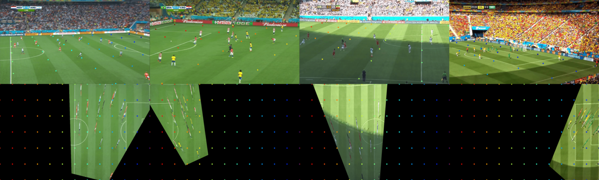

# Deep Learning Homography Estimation (DLHE) for Sports Field Registration


## Overview

This repo contains my implementation of a deep neural network (DNN) for estimating the homography between two images of a sports field. 

## Installation

### github clone + pip

1. Clone the repo:

```bash
git clone https://github.com/AtomScott/homography-estimation.git
```

2. Install the dependencies:

```bash
pip install -r requirements.txt
cd homography-estimation
```

3. Install the repo as a package
  
```bash
pip install -e .
```

### Docker

(Work in progress)
## Dataset Preparation

I used the WorldCup Dataset and SoccerNet Calibration Dataset to train the network. The TS-WorldCup Dataset is used only for testing the performance of the network on sequences of images. In this implementation, the network is trained to detection uniformally distributed keypoints in the image. I've added an image to show an example of what the network should learn.



Below are instructions for downloading and preparing each dataset.

### WorldCup Dataset

1. Download the file from one of the links:

* https://github.com/nhoma/nhoma.github.io/blob/4c204105f2c9511ec071fde42c842784447c7578/data/soccer_data.tar.gz
* https://nhoma.github.io/data/soccer_data.tar.gz

2. Extract the file. Confirm the directory structure is as follows:
   ```
   raw/
    ---train_val/
        ---1_grass_gt.mat
        ---1.homographyMatrix
        ---1.jpg
        ---...
    ---test/
        ---1_grass_gt.mat
        ---1.homographyMatrix
        ---1.jpg
        ---...
    
   ```

3. Run the following script to prepare the dataset.

```python
dlhe prepare_dataset --dataset_dir raw/ --output_dir data/wc_dataset --dataset worldcup --visualize
```


#### Credits
```
@inproceedings{homayounfar2017sports,
  title={Sports field localization via deep structured models},
  author={Homayounfar, Namdar and Fidler, Sanja and Urtasun, Raquel},
  booktitle={Proceedings of the IEEE Conference on Computer Vision and Pattern Recognition},
  pages={5212--5220},
  year={2017}
}
```

### TS-WorldCup Dataset

1. Download the file from one of the links:

* https://ericsujw.github.io/KpSFR/

2. Extract the file. Confirm the directory structure is as follows:
   ```
   TS-WorldCup/
    ---Annotations/
      ---80_95/
        ---right/
        ---left/
          ---2014_Match_Highlights1_clip_00007-1/
            ---IMG_0001_homography.npy
            ---IMG_0002_homography.npy
            ---...
    ---Dataset/
      ---80_95/
        ---right/
        ---left/
          ---2014_Match_Highlights1_clip_00007-1/
            ---IMG_0001.jpg
            ---IMG_0002.jpg
            ---...
    ---test.txt
    ---train.txt    
   ```

3. Run the following script to prepare the dataset.

```python
dlhe prepare_dataset --dataset_dir raw/ --output_dir data/wc_dataset --dataset ts_worldcup --visualize
```

#### credits
```
@inproceedings{chu2022sports,
  title={Sports Field Registration via Keypoints-Aware Label Condition},
  author={Chu, Yen-Jui and Su, Jheng-Wei and Hsiao, Kai-Wen and Lien, Chi-Yu and Fan, Shu-Ho and Hu, Min-Chun and Lee, Ruen-Rone and Yao, Chih-Yuan and Chu, Hung-Kuo},
  booktitle={Proceedings of the IEEE/CVF Conference on Computer Vision and Pattern Recognition},
  pages={3523--3530},
  year={2022}
}
````

### SoccerNet Calibration Dataset

(Work in progress)

## Run Training

(Work in progress)

## Run Evaluation

(Work in progress)

## Run Inference

(Work in progress)


## Dev Setup

Before building dokcer container, prepare .env file by the following command.

```
cp .env{.template,}
```

To you use the vs-code settings template, do you the same for .code-workspace file.

```
cp .code-workspace{.template,}
```